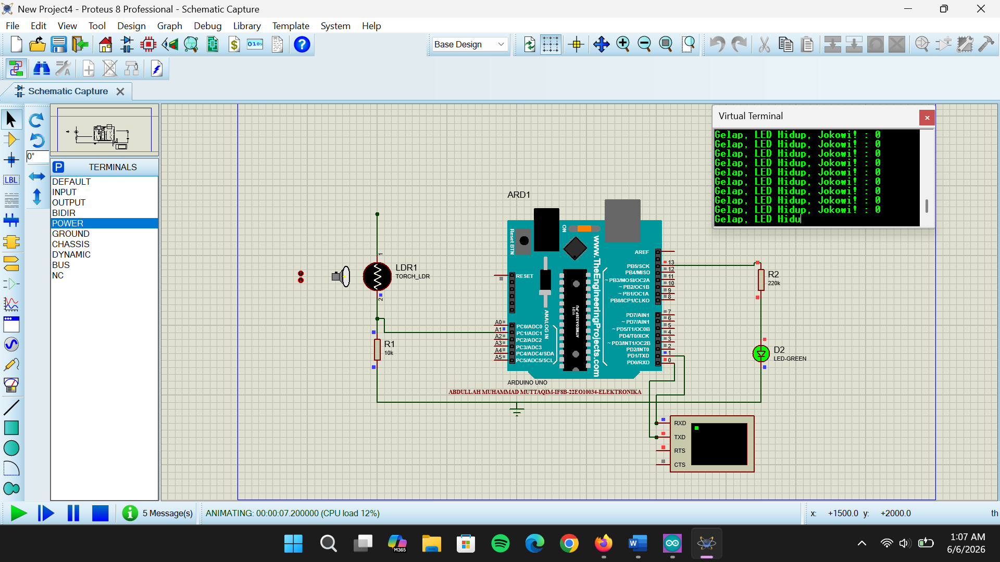

# Arduino LDR Sensor Project

## Deskripsi

Proyek ini merupakan simulasi sensor cahaya menggunakan **LDR (Light Dependent Resistor)** dan **Arduino Uno** pada Proteus. Sistem dirancang untuk mendeteksi intensitas cahaya dan mengendalikan LED secara otomatis berdasarkan nilai pembacaan sensor.

## Komponen yang Digunakan

* Arduino Uno
* LDR (Light Dependent Resistor)
* LED
* Resistor 10 kΩ
* Resistor LED
* Virtual Terminal
* Proteus 8 Professional

## Cara Kerja

Arduino membaca nilai analog dari sensor LDR melalui pin A1 menggunakan fungsi `analogRead()`. Nilai tersebut kemudian dibandingkan dengan batas (threshold) sebesar 200.

* Jika nilai ≤ 200, kondisi dianggap gelap dan LED akan menyala.
* Jika nilai > 200, kondisi dianggap terang dan LED akan mati.

Hasil pembacaan sensor ditampilkan pada Virtual Terminal melalui komunikasi serial dengan baud rate 9600 bps.

## Program Arduino

File program utama:

```text
sketch_may28a.ino
```

## Hasil Simulasi




## Hasil Pengujian

* LDR tanpa sumber tegangan menghasilkan nilai pembacaan 0.
* Setelah LDR terhubung ke sumber tegangan (+5V), nilai pembacaan meningkat sesuai intensitas cahaya.
* Pada kondisi terang, nilai sensor dapat mencapai 1023 dan LED berada dalam kondisi mati.
* Sistem bekerja sesuai logika program yang telah dibuat.

## Author

Abdulloh Muhammad Muttaqin
